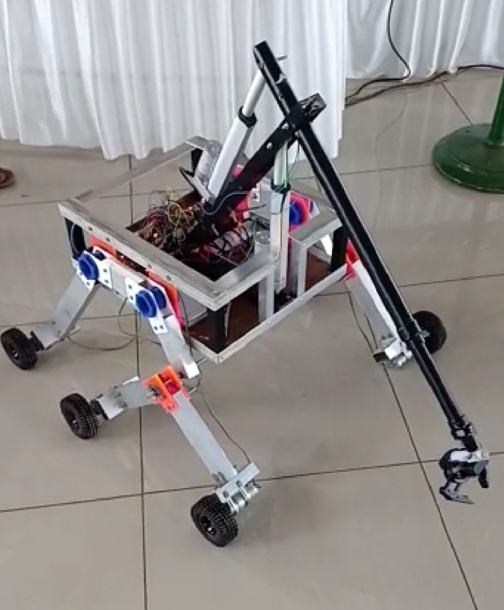
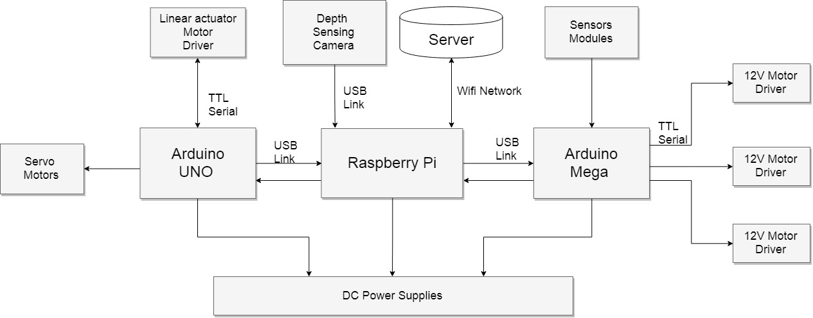

With the future of humanity looking forward to spacefaring civilization,Mars the red planet has a promising future in making humans’multiplanetary species. The Mars rover will one day work alongside astronauts exploring the red planet. The rover is a wheeled robot, with manipulator arm that can autonomously drive and remotely controlled. It is built to perform scientific experiments and maintenance for a simulated Mars environment with challenging missions such as site survey, sample return, equipment servicing, and assistance.

# WORKING

There are mainly 4 tasks performed by the rover.
(1) Autonomous task
(2) Equipment servicing
(3) Astronaut assistance
(4) Soil sampling

In autonomous task the rover should automatically traverse through filed markers. Depth sensing camera is used to analyse the path and move along the file markers. Rocker bogie mechanism will help the rover to move through uneven terrains.The equipment servicing task includes pushing buttons, flipping switches, turn knobs etc. The gripper attached to then end of the robotic arm will help to perform this task. In astronaut assistance task the rover should assist the astronaut by picking up objects.This task is performed with the help of robotic arm. In soil sampling the rover should collect soil samples from required places and should perform soil analysis. The Archimedes drill mechanism helps to collect the soil and the sensors will help to determine soil parameters.

# ACHIEVEMENTS

The Indian Rover Challenge (IRC) is an annual robotics competition which features an engineering challenge to engage students worldwide in the next phase of space exploration.Indian Rover Challenge is a part of the Rover Challenge Series (RCS) of The Mars Society. Our rover was one among the 19 teams which were selected for the challenge in the year 2019.

